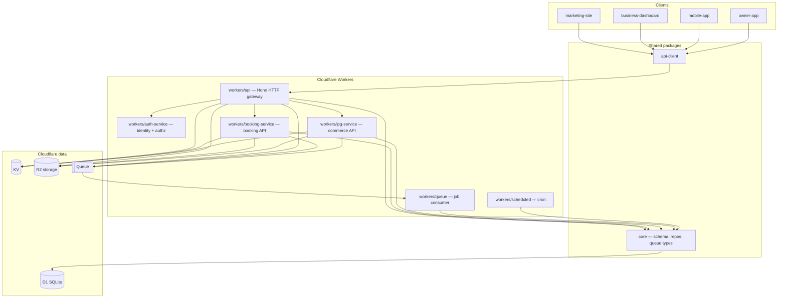

# Architecture overview

High-level map of the Talash monorepo — how packages, workers, and apps fit together.

---

## System diagram

---

## Domain model: `business` as tenant root

The platform is **multi-vertical**. The tenant root is `businesses` (renamed from `venues` in
migration 0012); every domain row chains ownership up to a business. Each business carries an
immutable `vertical` column that selects which feature modules apply:

| Vertical   | Module set                                                              | Tenant children                          |
| ---------- | ----------------------------------------------------------------------- | ---------------------------------------- |
| `booking`  | `bookings`, `services`, `staff`, `analytics`, `reviews`, `coupons`      | branches → services → bookings           |
| `commerce` | `products`, `orders` (+ `order-items`), `payments`, `khata` (due-ledger) | branches → products → orders             |

Shared across verticals: `branches`, `users`, `auth`, `favourites`, `notifications`, search.
Ownership is enforced by `AuthorizationService.assertBusinessOwner` (renamed from
`assertVenueOwner`); cross-business access is rejected at the service layer. Clients resolve the
vertical at the edge (vertical-aware client shell) and mount only the matching feature modules.

New verticals plug in by adding a `vertical` value + a module set mounted alongside the existing
apps in [`routes.ts`](../workers/api/src/modules/routes.ts) — no change to the tenant root. See
[adr/0004-multi-vertical-platform-extension.md](adr/0004-multi-vertical-platform-extension.md) and
[plan/multi-vertical-schema-design.md](plan/multi-vertical-schema-design.md).

---

## Monorepo layout

| Path                       | Package                    | Role                                                         |
| -------------------------- | -------------------------- | ------------------------------------------------------------ |
| `packages/core`            | `@repo/core`               | Drizzle schema, repositories, queue job types, notifications |
| `packages/api-client`      | `@repo/api-client`         | Typed HTTP client for all frontends                          |
| `workers/api`              | `@repo/api`                | Public HTTP gateway (Hono on Workers)                        |
| `workers/auth-service`     | `@repo/auth-service`       | Identity + authz (`/api/v1/auth/*`, `/api/v1/users/*`)       |
| `workers/lpg-service`      | `@repo/lpg-service`        | Commerce API (`/api/v1/products`, `/orders`, etc.)           |
| `workers/booking-service`  | `@repo/booking-service`    | Booking API (`/api/v1/services`, `/bookings`, `/team`, etc.) |
| `workers/queue`            | `@repo/queue`              | Async job processor (emails, notifications, etc.)            |
| `workers/scheduled`        | `@repo/scheduled`          | Cron-triggered tasks                                         |
| `apps/mobile-app`          | `@repo/mobile-app`         | Customer Expo app                                            |
| `apps/owner-app`           | `owner-app`                | Owner Expo app                                               |
| `sites/marketing-site`     | `@repo/marketing-site`     | Customer Next.js site                                        |
| `sites/business-dashboard` | `@repo/business-dashboard` | Owner Next.js dashboard                                      |
| `tools/cli`                | —                          | Local DB seed/migrate (bun:sqlite)                           |

Turborepo orchestrates `lint`, `test`, `build`, and `deploy` across packages. A change in `packages/core` triggers rebuilds of every worker and app that imports it.

---

## Request path (synchronous)

1. **Client** calls `api.<module>.<method>()` from `@repo/api-client`
2. **HTTP** hits `workers/api` at `/api/v1/...`
3. **Gateway routing** — `/api/v1/auth/*` and `/api/v1/users/*` → `auth-service`; booking prefixes (`/services`, `/bookings`, `/team`, `/coupons`, `/reviews`, `/rewards`, `/analytics`, `/campaigns`, `/customers`) → `booking-service`; commerce prefixes (`/products`, `/orders`, `/customer-addresses`, `/payments`, `/khata`) → `lpg-service`; `/search` and `/walk-in` are **vertical dispatchers** on the gateway (fan-out/fan-in where needed). All via Service Bindings; clients keep the same public base URL.
4. **Middleware** (gateway) — CORS, query parser, JWT auth, RBAC, rate limits, 15 s timeout
5. **Route handler** validates input, delegates to **service**
6. **Service** applies business rules, calls **repository** in `@repo/core`
7. **Repository** runs Drizzle queries against **D1**
8. Response shaped as `{ data: T }` or `PaginatedResponse<T>`

Layer rule: **Route → Service → Repository → DB**. No business logic in route handlers.

### Auth-service split

| Concern | Owner |
| --- | --- |
| `/api/v1/auth/*`, `/api/v1/users/*` | `workers/auth-service` (implemented behind gateway proxy) |
| Shell `/api/v1/*` (`businesses`, `branches`, `notifications`, `favourites`, `demo-requests`) + `/search` / `/walk-in` dispatch | `workers/api` |
| Booking vertical modules | `workers/booking-service` (behind gateway proxy) |
| JWT verification on domain routes | `workers/api` (local `SessionTokens.verify`) |
| Branch scope (`scopedBranchIds`) | `workers/api` calls auth-service `POST /internal/authorise` when `requireAuth({ branchScope: true })` |

Design: [superpowers/specs/2026-06-16-auth-service-split-design.md](superpowers/specs/2026-06-16-auth-service-split-design.md) · Worker guide: [workers/auth-service/CLAUDE.md](../workers/auth-service/CLAUDE.md)

### LPG-service split

| Concern | Owner |
| --- | --- |
| `/api/v1/products`, `/orders`, `/customer-addresses`, `/payments`, `/khata` | `workers/lpg-service` (behind gateway proxy) |
| Platform shell routes (`businesses`, `branches`, …) | `workers/api` |
| Commerce search + walk-in | `workers/lpg-service` (behind gateway dispatch for `/search` / `/walk-in`) |
| JWT + branch scope on commerce routes | `workers/lpg-service` (local JWT + `auth-service` `POST /internal/authorise`) |

Design: [superpowers/specs/2026-06-16-lpg-service-split-design.md](superpowers/specs/2026-06-16-lpg-service-split-design.md) · Worker guide: [workers/lpg-service/CLAUDE.md](../workers/lpg-service/CLAUDE.md)

### Booking-service split

| Concern | Owner |
| --- | --- |
| `/api/v1/services`, `/bookings`, `/team`, `/coupons`, `/reviews`, `/rewards`, `/analytics`, `/campaigns`, `/customers` | `workers/booking-service` (behind gateway proxy) |
| `GET /api/v1/search?vertical=booking` | `workers/booking-service` (gateway dispatches on `vertical`) |
| Booking walk-in paths (`/walk-in/*` for booking branches) | `workers/booking-service` (gateway resolves branch vertical) |
| Shell routes + vertical dispatch for `/search` and `/walk-in` | `workers/api` |
| JWT + branch scope on booking routes | `workers/booking-service` (local JWT + `auth-service` `POST /internal/authorise`) |

Plan: [superpowers/plans/2026-06-16-booking-service-split.md](superpowers/plans/2026-06-16-booking-service-split.md) · Worker guide: [workers/booking-service/CLAUDE.md](../workers/booking-service/CLAUDE.md)

See [guides/api-query-repository-pattern.md](guides/api-query-repository-pattern.md).

---

## Async path (queue)

1. API enqueues a job via `TALASH_QUEUE` binding (`QueueProducer` in core)
2. `workers/queue` consumes messages and runs handlers (notifications, email, etc.)
3. Failures retry per Cloudflare Queue policy

Scheduled tasks in `workers/scheduled` run on cron triggers (session cleanup, reminders, etc.).

---

## Data stores

| Binding          | Type          | Used for                                              |
| ---------------- | ------------- | ----------------------------------------------------- |
| `TALASH_DB`      | D1            | Primary SQLite database (businesses, bookings, users, …) |
| `TALASH_KV`      | KV            | Auth state nonces, rate limiting, business profile cache |
| `TALASH_STORAGE` | R2            | Business and service photos                           |
| `TALASH_QUEUE`   | Queue         | Background jobs                                       |
| `TALASH_AI`      | Workers AI    | Search re-ranking (optional)                          |
| `TALASH_EMAIL`   | Email Sending | Transactional email                                   |

Local dev uses Wrangler's local D1/KV/R2 emulation. Seed data: `bun run cli db seed`.

---

## Authentication

All four frontends use **Google OAuth** (redirect flow):

`GET /auth/google` → Google → callback → `POST /auth/google/callback` → JWT access + refresh tokens.

Mobile EAS builds can use native Google Sign-In (`POST /auth/google/token`) but redirect is the default in Expo Go.

Tokens stored per platform: `localStorage` (web), SecureStore (mobile). Refresh via `POST /auth/refresh`.

**Implementation:** auth routes are served by `workers/auth-service` and proxied through `workers/api`. The gateway still verifies JWTs locally for domain routes. Local dev requires both workers running — see [guides/local-dev.md](guides/local-dev.md).

See [guides/google-auth.md](guides/google-auth.md).

---

## Frontend architecture

| Surface            | Users              | State pattern                                            |
| ------------------ | ------------------ | -------------------------------------------------------- |
| marketing-site     | Customers (web)    | TanStack Query + `tokenStore`; mostly page-level queries |
| business-dashboard | Owners (web)       | TanStack Query; hooks in `useOwnerData.ts`               |
| mobile-app         | Customers (mobile) | `AppProvider` context + dedicated hooks                  |
| owner-app          | Owners (mobile)    | `AppProvider` context + `useOwnerData.ts`                |

Shared wiring rules: [guides/ui-backend-sync.md](guides/ui-backend-sync.md).

API types flow: `workers/api` DTOs → `@repo/api-client` exports → app adapters (`src/lib/adapters.ts` on mobile/owner).

---

## Deployment

| Target                                 | Trigger                      | Tool                                                      |
| -------------------------------------- | ---------------------------- | --------------------------------------------------------- |
| `workers/api`, `auth-service`, `booking-service`, `lpg-service`, `queue`, `scheduled` | Push to `main` (path-scoped) | `wrangler-action` with `wrangler deploy --env production` |
| `marketing-site`, `business-dashboard` | Push to `main` (path-scoped) | OpenNext → Cloudflare Pages                               |
| Mobile apps                            | Manual                       | EAS CLI (`bun run mobile-app:build:prod`, etc.)           |

CI: [guides/ci-cd.md](guides/ci-cd.md). D1 migrations run automatically before API deploy.

---

## API discovery

- **Markdown index:** [guides/api-endpoints.md](guides/api-endpoints.md)
- **Live API reference (Scalar):** `http://localhost:8787/api/docs` when `bun run api:dev` is running
- **OpenAPI JSON:** `/api/docs/openapi.json`

---

## Related docs

- [getting-started.md](getting-started.md) — local setup
- [feature-map.md](feature-map.md) — backend ↔ frontend coverage
- [workers/api/CLAUDE.md](../workers/api/CLAUDE.md) — API gateway worker deep dive
- [workers/auth-service/CLAUDE.md](../workers/auth-service/CLAUDE.md) — identity + authz worker
- [workers/booking-service/CLAUDE.md](../workers/booking-service/CLAUDE.md) — booking vertical worker
- [packages/core/CLAUDE.md](../packages/core/CLAUDE.md) — shared library
