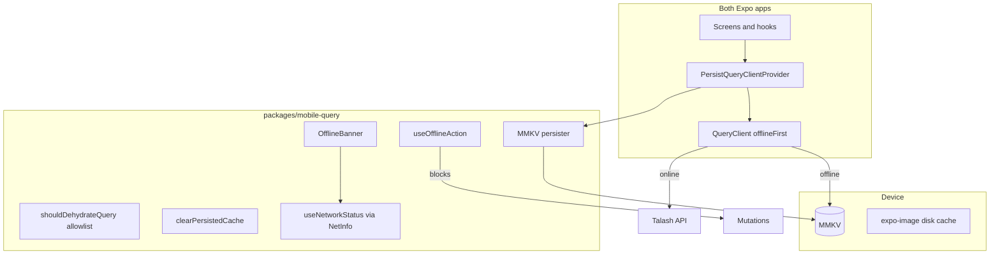

# Mobile offline read-only — Design

- **Date:** 2026-06-12
- **Apps:** `apps/mobile-app` (customer), `apps/owner-app` (owner)
- **Status:** approved — ready for implementation plan

## Problem

Both Expo apps are online-only today. TanStack Query holds data in memory (`staleTime: 30s` default); nothing survives an app restart. When connectivity drops — common on mobile networks in Bangladesh — users see spinners, errors, or blank screens even for data they fetched minutes ago.

`useNetworkStatus` + `OfflineBanner` detect offline state but do not change behaviour. SecureStore persists auth tokens and a few small flags only.

## Goal

**Phase 1 — read-only offline resilience** for both apps:

- Show the last successfully fetched data when offline or after restart.
- Refresh from the API whenever online (no hard TTL expiry).
- Block all write/mutation actions offline with clear messaging.
- Wipe all cached API data on sign-out.

Phase 2 (offline write queue / sync) is documented in [2026-06-12-mobile-offline-write-queue-design.md](./2026-06-12-mobile-offline-write-queue-design.md).

## Decisions

| Area | Decision |
| --- | --- |
| **Approach** | TanStack Query persistence layer — not SQLite entity cache, not per-screen manual JSON blobs |
| **Shared package** | New `packages/mobile-query` — persister, query client factory, allowlist, hooks, shared banner |
| **Storage** | `react-native-mmkv` (sync, fast). AsyncStorage fallback if MMKV blocks Expo Go dev |
| **Freshness** | Last successful fetch; `gcTime: Infinity`; refresh when online; no auto-expiry |
| **Sign-out** | Clear MMKV persist blob + `queryClient.clear()` + token clear (extend existing handlers) |
| **Scope** | All read surfaces in both apps (bookings, search, favourites, catalog, team, khata, analytics, orders, profile, etc.) |
| **Writes offline** | Disabled everywhere; toast on attempted action |
| **401 offline** | Do not clear session — token may still be valid; revalidate when back online |
| **Images** | `expo-image` `cachePolicy="memory-disk"` — viewed images available offline; never-seen images show placeholder |
| **Network detection** | Replace Google `generate_204` ping with `@react-native-community/netinfo` |

## Architecture

### `packages/mobile-query` exports

| Export | Purpose |
| --- | --- |
| `createMobileQueryClient(appId)` | QueryClient with offline-first defaults |
| `createQueryPersister(appId)` | MMKV-backed persister (key scoped per app) |
| `PersistQueryClientProvider` | Re-export/wrap TanStack persist provider |
| `shouldDehydrateQuery(query)` | Prefix allowlist; only `status === 'success'` |
| `clearPersistedCache(appId)` | Remove persist blob — call on sign-out |
| `useNetworkStatus()` | NetInfo wrapper (`isOnline`) |
| `useOfflineAction()` | `{ canAct, offlineMessage }` for mutation gates |
| `OfflineBanner` | Amber when cached data visible; red when no cache |
| `StaleDataNote` | Optional inline "Saved · last updated …" using `dataUpdatedAt` |

### App integration (both apps)

1. Replace local `query-client.ts` usage with `createMobileQueryClient('mobile-app' \| 'owner-app')`.
2. Wrap root in `PersistQueryClientProvider` (replaces bare `QueryClientProvider`).
3. Call `clearPersistedCache(appId)` inside existing `signOut()` after `qc.clear()`.
4. Replace local `useNetworkStatus` / `OfflineBanner` with shared exports.
5. Gate mutation entry points with `useOfflineAction()`.

## Persistence policy

| Setting | Value | Rationale |
| --- | --- | --- |
| `networkMode` | `'offlineFirst'` | Serve cache immediately; background refetch when online |
| `gcTime` | `Infinity` | No hard expiry per product decision |
| `staleTime` | Per-query overrides unchanged | Online refresh behaviour preserved |
| `retry` | `false` when offline | Avoid pointless retries |
| Persist debounce | 2s after cache mutation | Reduce MMKV writes |
| Persister `maxAge` | `Infinity` | Lifecycle managed via sign-out, not TTL |

**Cold start:** `PersistQueryClientProvider` rehydrates before first paint. Screens render cached data instantly; background refetch runs if online.

**Corrupt rehydration:** Log warning, call `clearPersistedCache()`, start fresh — app must not crash.

## Query allowlist

`shouldDehydrateQuery` matches query keys by **prefix segments** — an entry `['bookings', 'calendar']` matches `['bookings', 'calendar', branchId, start, end]`. Only queries with `status === 'success'` are dehydrated.

### Persist

**Shared (both apps):** `auth/me`, `auth/sessions`, `notifications`

**Customer (`mobile-app`):**

`bookings`, `booking`, `business`, `business/detail`, `service`, `branch`, `search`, `favourites`, `business-photos`, `reviews`, `business-coupons`, `branch-hours`, `rewards`, `orders`, `order`, `products`, `addresses`, `branches` (map-pin)

**Owner (`owner-app`):**

`business/owner`, `business-content`, `business-products`, `bookings`, `bookings/calendar`, `booking`, `reviews`, `coupons`, `coupon`, `team`, `campaigns`, `customers`, `customer-visits`, `business-photos`, `branch-hours`, `staff-availability`, `branch-orders`, `order`, `khata-dues`, `khata-customer`, `analytics`, `branches`

Queries with `staleTime: 0` (e.g. `booking`, `order` detail sheets) **are persisted** — last-known state offline with stale indicator.

### Exclude

| Prefix | Reason |
| --- | --- |
| `branch-availability` | Slot data meaningless offline; booking flow blocked anyway |
| `users/search` | Team invite search — empty offline acceptable |

## Offline UX

### Banner states

| Condition | Copy | Colour |
| --- | --- | --- |
| Offline + cached data on screen | "You're offline — showing saved data" | Amber/warning |
| Offline + no cached data | "No internet connection" | Red |

### Mutation gating

`useOfflineAction()` returns `canAct: false` when offline.

**Customer — gate:** book, cancel, review, favourite toggle, place order, save address, profile edit.

**Owner — gate:** confirm/decline/complete/assign booking, catalog CRUD, team edits, record/void payment, status toggle, photo upload, coupon create, branch/service/product sheets, swipe actions on booking cards.

When blocked: disable control + toast *"You're offline. Connect to the internet to do this."*

### Empty states

Offline with no prior fetch for a screen:

> *No saved data for this screen. Connect to load it.*

Not a perpetual spinner. Pull-to-refresh visible; no-ops offline with toast.

### Auth offline

- Valid token in SecureStore → stay authed; `auth/me` from cache.
- Sign-in / OAuth → require network.
- Sign-out → works offline (clear cache + tokens).

### Stale indicator

On detail screens when offline: inline note using `query.dataUpdatedAt`:

> *Saved · last updated 2 hours ago*

Hidden when online.

## Images

Add `cachePolicy="memory-disk"` to `Photo` (`expo-image`) and any direct `Image` usage with remote URIs in both apps. Images viewed online are available offline via expo-image disk cache. No custom prefetch queue in phase 1.

## Error handling

| Scenario | Behaviour |
| --- | --- |
| Online fetch fails, cache exists | Show cache; optional subtle "Couldn't refresh" on refetch error |
| Online fetch fails, no cache | Existing error UI + Retry |
| Offline, cache exists | Render cache + amber banner |
| Offline, no cache | Empty state copy |
| Persist rehydration corrupt | Clear persist, start fresh |
| Cache size | No cap phase 1; revisit with telemetry |
| 401 while offline | Keep session; revalidate when online |

## Testing

### Unit (`packages/mobile-query`)

- `shouldDehydrateQuery` — included/excluded prefixes, non-success status excluded
- `clearPersistedCache` — storage key removed
- `useOfflineAction` — `canAct: false` when offline (mock NetInfo)

### Manual QA (both apps)

1. Load screen online → aeroplane mode → data visible
2. Kill app → reopen offline → data visible
3. Mutation buttons disabled + toast offline
4. Sign out → reopen → no previous user's data
5. Never-visited screen offline → empty state, not spinner
6. Images previously loaded → visible offline

## Implementation order

1. **`packages/mobile-query`** — persister, client factory, allowlist, hooks, banner
2. **`mobile-app`** — layout wiring, sign-out, mutation gates
3. **`owner-app`** — same
4. **Images + NetInfo** — `Photo` cachePolicy; remove `generate_204` ping
5. **Docs** — `docs/guides/mobile-offline.md`; update `apps/mobile-app/AGENTS.md`, `apps/owner-app/AGENTS.md`, link from `docs/README.md`

## Out of scope (phase 2+)

- Offline mutation queue / sync when back online
- SQLite local database / WatermelonDB
- Cache size limits / LRU eviction
- Image prefetch pipeline
- Offline search against uncached queries
- Server-side changes

## Dependencies (new)

| Package | Used by |
| --- | --- |
| `@tanstack/react-query-persist-client` | `packages/mobile-query` |
| `@tanstack/query-async-storage-persister` or custom MMKV persister | `packages/mobile-query` |
| `react-native-mmkv` | Both apps (via `mobile-query`) |
| `@react-native-community/netinfo` | Both apps (via `mobile-query`) |
