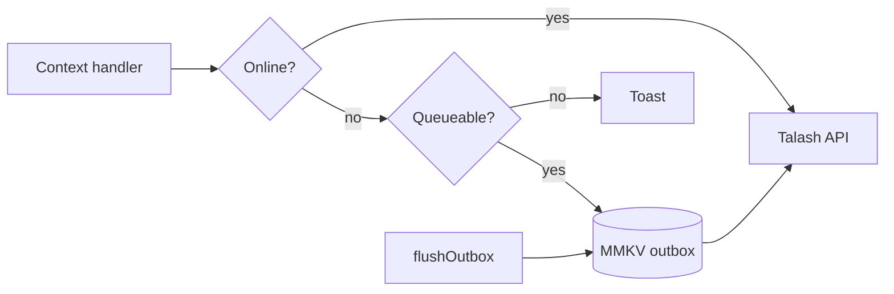

# Mobile offline write queue — Design (phase 2)

- **Date:** 2026-06-12
- **Depends on:** [2026-06-12-mobile-offline-read-only-design.md](./2026-06-12-mobile-offline-read-only-design.md) (phase 1)
- **Apps:** `apps/mobile-app`, `apps/owner-app`
- **Status:** approved — ready for implementation

## Problem

Phase 1 blocks all writes offline. Owners lose signal after a booking notification and cannot confirm until back online — the highest-value offline gap for Talash.

## Decision (product)

**Option A — owner-first write queue:**

- **Owner app:** queue booking lifecycle mutations offline (confirm, decline/cancel, complete, assign).
- **Customer app:** remain read-only for bookings/orders; queue only low-risk writes (favourite toggle, cancel pending booking, mark notifications read).
- **Both:** new booking / new order / catalog / khata / photos stay blocked offline.

## Architecture

Extend `@repo/mobile-query` with an MMKV **mutation outbox** (separate key from query cache).



### Outbox entry

```ts
type OutboxEntry = {
  id: string;
  mutationType: OutboxMutationType;
  payload: unknown;
  createdAt: number;
  retryCount: number;
  status: "pending" | "failed";
};
```

### Queue allowlist

**Owner (`owner-app`):**

| `mutationType` | API |
| --- | --- |
| `bookings.confirm` | `api.bookings.confirm(id)` |
| `bookings.cancel` | `api.bookings.cancel(id)` |
| `bookings.complete` | `api.bookings.complete(id)` |
| `bookings.assign` | `api.bookings.assign(id, { staffId })` |
| `notifications.markRead` | `api.notifications.markRead(id)` |
| `notifications.markAllRead` | `api.notifications.markAllRead()` |

**Customer (`mobile-app`):**

| `mutationType` | API |
| --- | --- |
| `favourites.add` | `api.favourites.add(businessId)` |
| `favourites.remove` | `api.favourites.remove(businessId)` |
| `bookings.cancel` | `api.bookings.cancel(id)` |
| `notifications.markRead` | `api.notifications.markRead(id)` |
| `notifications.markAllRead` | `api.notifications.markAllRead()` |

### Flush behaviour

- **Triggers:** NetInfo online, app foreground (`AppState` active).
- **Order:** FIFO per app.
- **Success:** remove entry; caller invalidates affected query keys.
- **Conflict (409/422 on booking actions):** remove entry; executors return `{ conflict: true }`; UI toast “This booking was already updated.”
- **Network error:** increment `retryCount`; stop flush batch; retry next trigger (max 5).
- **401:** pause flush (do not clear outbox); resume after re-auth.

### Optimistic UI

Apps apply existing TanStack optimistic updates **before** enqueue (same as online `onMutate`). Pending entries tracked via `useOutbox(appId)` for row badges.

**Owner booking row:** amber “Pending sync” when outbox contains an entry for that booking id.

### Sign-out

`clearOutbox(appId)` + `clearPersistedCache(appId)` + `queryClient.clear()`.

### New exports (`@repo/mobile-query`)

| Export | Purpose |
| --- | --- |
| `enqueueOutboxEntry(appId, entry)` | Persist pending mutation |
| `flushOutbox(appId, executors)` | Process queue |
| `clearOutbox(appId)` | Sign-out |
| `useOutbox(appId)` | `{ pendingCount, failedCount, entries, hasPendingForBooking(id) }` |
| `useOutboxSync(appId, executors)` | Auto-flush on reconnect |
| `isQueueableMutation(type, appId)` | Allowlist check |
| `PendingSyncBanner` | “N actions waiting to sync” when `pendingCount > 0` and offline or flushing |
| `OutboxSyncProvider` | Wrap app; runs `useOutboxSync` |

Executor map type: `Record<OutboxMutationType, (payload: unknown) => Promise<{ conflict?: boolean }>>` — registered per app in `_layout` or `query-client.ts`.

## Out of scope (phase 3)

- Owner catalog CRUD, khata, commerce order status queue
- Customer new booking / new order queue
- Photo upload queue
- SQLite / WatermelonDB

## Testing

**Unit (`packages/mobile-query`):** enqueue, flush success, conflict removal, retry cap, clear on sign-out, allowlist.

**Manual QA:**

1. Owner confirms offline → pending badge → online → synced + toast
2. Customer favourites offline → syncs silently
3. Sign out → outbox empty
4. Conflict: booking already cancelled server-side → entry dropped + message
