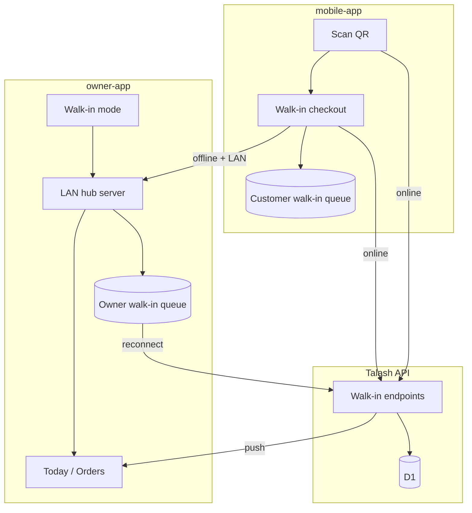
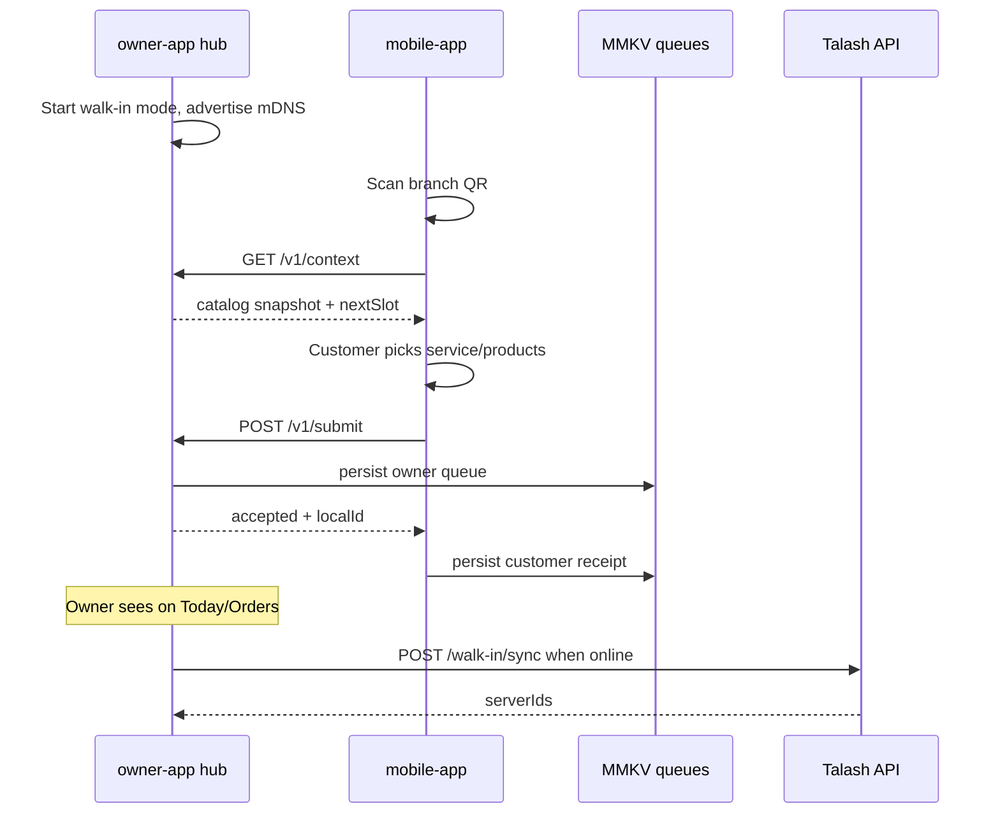

# Walk-in QR + LAN sync — Design

- **Date:** 2026-06-12
- **Depends on:** [2026-06-12-mobile-offline-read-only-design.md](./2026-06-12-mobile-offline-read-only-design.md) (phase 1), [2026-06-12-mobile-offline-write-queue-design.md](./2026-06-12-mobile-offline-write-queue-design.md) (phase 2)
- **Apps:** `apps/mobile-app`, `apps/owner-app`, `sites/marketing-site` (universal-link landing)
- **Package:** `@repo/walk-in-sync` (new)
- **Status:** B1 + B2 implemented

## Problem

Walk-in customers at salons and LPG counters need to book or order without searching the app, picking dates, or entering a delivery address. In shops with poor mobile data, the owner must still see submissions in real time when both phones share the same Wi‑Fi.

Today:

- Customer booking requires sign-in, internet, and a full slot-picker flow (`apps/mobile-app`).
- Commerce orders require a delivery address and online connection.
- Bookings and orders require a `userId` — no guest path exists.
- Offline phase 2 queues owner lifecycle actions but blocks new bookings/orders ([mobile-offline.md](../../guides/mobile-offline.md)).
- No QR or local-network sync exists.

## Product decisions (brainstorming)

| Decision | Choice |
| --- | --- |
| Verticals | Both booking and commerce; shared QR entry routes by `business.vertical` |
| QR direction | Either — persistent branch QR **or** owner-started session QR; owner can also reverse-scan customer receipt QR |
| Auth | Optional — signed-in customers get history/rewards; guests provide name + phone |
| Fast checkout | Booking: service → book now (next slot). Order: products → pay at counter (no address) |
| Offline | LAN sync + local queue on both apps; owner device uploads when back online |
| Architecture | **Approach B — owner-hub LAN sync** (see alternatives below) |

### Approaches considered

| Approach | Summary | Verdict |
| --- | --- | --- |
| A — Cloud walk-in only | QR + API; no real-time LAN | Too limited — rejected as sole solution; usable as **B1** slice |
| **B — Owner-hub LAN sync** | Owner advertises on LAN; customer submits over local HTTP; both queue; owner flushes to API | **Selected** |
| C — QR-embedded offline bundle | Customer carries catalog in QR; second scan to transfer | Rejected — poor UX |

## Goals (v1)

| Goal | Detail |
| --- | --- |
| Shared QR entry | One walk-in entry per branch; routes to booking or commerce by vertical |
| Either QR direction | Persistent branch QR or owner-started session QR |
| Optional auth | Signed-in → history/rewards; guest → name + phone only |
| Fast checkout | Booking: service → book now; Order: products → pay at counter |
| LAN fallback | Same Wi‑Fi, no internet → real-time owner visibility |
| Cloud sync | Owner device uploads queued walk-ins when back online |

## Architecture



**New package `@repo/walk-in-sync`:** LAN discovery, HTTP message protocol, MMKV queue, cloud flush. Both Expo apps depend on it.

**Authority model:** The owner device is the local source of truth when offline (catalog snapshot, submission receipt, upload queue). The customer keeps a receipt copy for their UI; cloud sync is driven by the owner's authenticated session.

**Online vs LAN:** When internet is available, prefer the Talash API (authoritative slot/stock). LAN is the fallback when offline but both devices share Wi‑Fi.

### Phasing

| Phase | Scope |
| --- | --- |
| **B1** | QR + online submit + guest schema + API + app UI (no LAN) |
| **B2** | `@repo/walk-in-sync` LAN hub + queue flush + offline banners |
| **B3** (out of scope v1) | Guest→account linking, walk-in coupons, dashboard QR print, khata for walk-in guests |

B1 is shippable alone; B2 completes the offline story without redesign.

## Dependencies (npm)

All LAN features require **EAS development/production builds** — they do not run in Expo Go. B1 uses mostly Expo SDK packages and works in dev builds once `expo-camera` is added.

### B1 — Online walk-in

| Need | Package | Notes |
| --- | --- | --- |
| Scan QR | [`expo-camera`](https://docs.expo.dev/versions/v56.0.0/sdk/camera/) | Official Expo SDK 56; built-in QR scanning (`barcodeTypes: ["qr"]`) |
| Display QR (owner) | [`react-native-qrcode-svg`](https://github.com/Expensify/react-native-qrcode-svg) | Expensify-maintained; works on RN 0.85; peer `react-native-svg` already in both apps |
| Deep links | `expo-linking` | Already installed |
| Queue / connectivity | `@repo/mobile-query` | MMKV + `@react-native-community/netinfo` already used |

### B2 — LAN discovery + owner hub

| Layer | Package | Role |
| --- | --- | --- |
| mDNS advertise + browse | [`react-native-zeroconf`](https://github.com/balthazar/react-native-zeroconf) | Owner **publishes** `_talash-walkin._tcp`; customer **scans**. Mature (~35k downloads/week), supports publish + discovery, Android 15 16KB page-size alignment |
| Owner HTTP hub | [`react-native-nitro-http-server`](https://github.com/iwater/react-native-nitro-http-server) | Dynamic routes for `/v1/context`, `/v1/submit`, etc.; Rust/Actix via Nitro; `autoRestart` after iOS background suspension |
| Nitro peer | `react-native-nitro-modules` | Required peer of nitro-http-server and optional bonjour alternative |
| Protocol validation | `zod` | Shared with API worker; used in `@repo/walk-in-sync/protocol` |
| Persistence | `react-native-mmkv` | Reuse via `@repo/mobile-query` queue patterns |

**Recommended stack for `@repo/walk-in-sync`:**

```
B1:  expo-camera + react-native-qrcode-svg + expo-linking
B2:  react-native-zeroconf + react-native-nitro-http-server (+ react-native-nitro-modules)
```

**Alternative (newer, less battle-tested):** [`@dawidzawada/bonjour-zeroconf`](https://github.com/dawidzawada/bonjour-zeroconf) instead of `react-native-zeroconf` — Nitro-based, typed, includes iOS local-network permission helpers. Prefer if Zeroconf publish API proves awkward during B2 spike.

**Fallback (minimal):** [`react-native-tcp-socket`](https://github.com/Rapsssito/react-native-tcp-socket) with a JSON-line protocol instead of HTTP — only if the Nitro HTTP server fails integration; loses standard REST semantics.

### Native configuration (B2)

**iOS** (`app.json` / `Info.plist`):

- `NSLocalNetworkUsageDescription` — explain shop Wi‑Fi pairing to the user
- `NSBonjourServices` — include `_talash-walkin._tcp`

**Android:**

- `INTERNET`, `ACCESS_WIFI_STATE` (typically merged by native modules)
- Test on API 33+ devices; some OEMs restrict LAN unless the app declares nearby Wi‑Fi use

### Packages explicitly out of scope for v1

| Package | Reason |
| --- | --- |
| `expo-http-server` | Stale (2024); iOS background ~25 s limit |
| WebRTC / Multipeer | Overkill for same-shop Wi‑Fi |
| Bluetooth / NFC | Different hardware story; not in spec |
| Pure JS mDNS (`bonjour`, etc.) | Unreliable on mobile without native APIs |

## QR formats and session model

### Two QR types

| Type | Who shows it | Purpose | Lifetime |
| --- | --- | --- | --- |
| **Branch QR** | Owner (print/tablet) or marketing site | Permanent entry for a branch | Until owner regenerates |
| **Session QR** | Owner during active walk-in mode | Pair a specific customer visit | 15 minutes (configurable) |

Both encode the same payload shape; session QR adds a `sessionToken`.

### URL structure

**Universal link (preferred for print/signage):**

```
https://talash.app/w/{branchId}
https://talash.app/w/{branchId}?s={sessionToken}
```

**App deep links:**

```
mobileapp://walk-in?branchId={branchId}
mobileapp://walk-in?branchId={branchId}&session={sessionToken}
```

Marketing site `/w/[branchId]` is a thin redirect page: open deep link if app installed; otherwise “Open in Talash” + store links.

Owner app can **reverse-scan** a customer receipt QR (see UI flows).

### Payload fields

```ts
type WalkInQrPayload = {
  branchId: string;
  businessId: string;
  vertical: "booking" | "commerce";
  sessionToken?: string;
  expiresAt?: number; // unix ms; session QR only
  signature: string; // HMAC — prevents forged branch IDs
};
```

- **Branch QR:** API generates once per branch (`POST /walk-in/branch-qr`); owner can regenerate (invalidates old signature).
- **Session QR:** Owner taps “Start walk-in” → API returns short-lived `sessionToken` bound to `branchId` + owner user id.

When **fully offline**, owner app uses a **locally signed session** (Ed25519 keypair generated on first walk-in mode, stored in SecureStore). Customer validates signature against owner's public key exchanged during LAN join.

### Scan routing (customer app)

```
Scan QR
  → parse branchId (+ optional sessionToken)
  → if online: GET /walk-in/context?branchId=&session=
  → if offline: discover owner on LAN for branchId
  → route by vertical:
       booking  → WalkInBookingScreen
       commerce → WalkInOrderScreen
```

## LAN sync protocol (`@repo/walk-in-sync`)

### Package modules

| Module | Responsibility |
| --- | --- |
| `discovery` | mDNS/Bonjour advertise + browse (`_talash-walkin._tcp`) |
| `hub-server` | Lightweight HTTP server on owner device (LAN only) |
| `hub-client` | Customer HTTP client targeting discovered owner |
| `protocol` | Shared message types + validation (Zod) |
| `queue` | MMKV persistence for pending walk-in submissions |
| `flush` | Owner-side upload to Talash API on reconnect |

Native modules per [Dependencies (npm)](#dependencies-npm). **LAN features require EAS builds**; Expo Go gets B1 (online walk-in) only.

### Discovery

Owner app in walk-in mode advertises:

```
Service: _talash-walkin._tcp.local
Port:    ephemeral (e.g. 8765)
TXT:     branchId, businessId, vertical, hubVersion, pubKey
```

Customer browses after scan. Match on `branchId` from QR. Timeout: 5 s, then “Couldn't find the shop on this network” with retry + receipt-QR fallback.

### Hub HTTP endpoints (LAN-only)

All requests include `X-WalkIn-Session: {sessionToken}` when pairing via session QR.

| Method | Path | Caller | Purpose |
| --- | --- | --- | --- |
| `GET` | `/v1/context` | Customer | Catalog snapshot, business name, vertical, next slot |
| `POST` | `/v1/submit` | Customer | Walk-in submission → `{ localId, status: "accepted" }` |
| `GET` | `/v1/status/{localId}` | Customer | Status updates from owner actions |
| `POST` | `/v1/lookup` | Owner | Reverse scan: receipt QR → submission |

Owner hub binds to **local Wi‑Fi IP only**. Stops when walk-in mode off or app backgrounded > 10 min.

### Catalog snapshot

Owner builds from TanStack Query cache (persisted via `@repo/mobile-query`):

**Booking:** active services (id, name, price, duration, photoUrl); `nextSlot` computed locally from branch hours + cached bookings.

**Commerce:** products (id, name, price, stock); `fulfillment: "counter"`.

Snapshot includes `snapshotAt`; customer shows “Prices as of …” when offline.

### Submission payload

```ts
type WalkInSubmission = {
  localId: string;
  branchId: string;
  vertical: "booking" | "commerce";
  customer: {
    userId?: string;
    guestName?: string;
    guestPhone?: string;
  };
  booking?: { serviceId: string; slot: string };
  order?: { items: { productId: string; qty: number }[] };
  total: number;
  submittedAt: number;
};
```

Owner hub validates against snapshot, persists to owner queue, updates Today/Orders UI, returns `{ localId, status: "accepted" }`. Customer persists receipt to customer queue.

### Cloud flush (owner only)

On reconnect: FIFO → `POST /api/v1/walk-in/sync` (batch, max 20) → API creates booking/order rows → returns `{ localId → serverId }` map → owner queue removes synced entries.

Customer queue is **receipt-only** for guests. Signed-in customers call `GET /walk-in/receipts` after reconnect (or invalidate booking/order queries) to link `walkInLocalId` → server id.

### LAN sequence



## Guest auth, schema, and API

### Guest auth

| Customer state | Required fields | Behaviour |
| --- | --- | --- |
| Signed in | `userId` from JWT | Normal booking/order; history, rewards, notifications |
| Guest | `guestName` + `guestPhone` | Transaction completes; no account created in v1 |

Guest phone used for owner display and optional SMS when online. No OTP in v1.

### Schema changes

**`bookings` — add:**

| Column | Type | Notes |
| --- | --- | --- |
| `source` | enum `app \| walk_in \| web` | Default `app` |
| `guestName`, `guestPhone` | text, nullable | Guest walk-ins |
| `walkInLocalId` | text, nullable | Idempotent sync |
| `userId` | nullable | Required when not guest |

Check: `(user_id IS NOT NULL) OR (guest_name IS NOT NULL AND guest_phone IS NOT NULL)`.

Unique index on `walk_in_local_id` (where not null).

**`orders` — add:**

| Column | Type | Notes |
| --- | --- | --- |
| `source`, `guestName`, `guestPhone`, `walkInLocalId` | | Same as bookings |
| `fulfillment` | enum `delivery \| counter` | Default `delivery` |
| `userId` | nullable | Guest counter orders |
| `deliveryLine` | nullable | Required only when `fulfillment = delivery` |

**Counter order status path:** `Pending → Confirmed → Delivered` (skip `OutForDelivery`). Delivery orders unchanged.

### API module: `/api/v1/walk-in`

| Method | Path | Auth | Purpose |
| --- | --- | --- | --- |
| `GET` | `/context?branchId=&session=` | Optional | Catalog + vertical; validates QR signature |
| `POST` | `/submit` | Optional | Online direct submit |
| `POST` | `/sync` | Owner | Batch upload from owner queue (idempotent on `walkInLocalId`) |
| `POST` | `/branch-qr` | Owner | Generate/regenerate signed branch QR |
| `POST` | `/sessions` | Owner | Create short-lived session token (15 min) |
| `GET` | `/receipts` | User (optional) | List caller's walk-in submissions synced from owner flush (signed-in only; matched by `walkInLocalId`) |

**`WalkInService.submit`** (shared by `/submit` and `/sync`):

1. Validate branch + vertical
2. **Booking:** reuse slot conflict, hours, overlap checks from `BookingsService`
3. **Order (counter):** reuse `OrdersRepository.placeOrder` with `fulfillment: counter`
4. Dedup on `walkInLocalId`
5. Enqueue notifications when online
6. Walk-in bookings default to **`Confirmed`** (owner present)

Owner list queries: `COALESCE(user.name, guest_name)` for display.

### `@repo/api-client`

New `walkIn` group: `getContext`, `submit`, `sync`, `createSession`, `regenerateBranchQr`.

## App UI flows

### Customer app (`mobile-app`)

**Entry:** Scan QR (`WalkInScanScreen`, `expo-camera`); Account tab “Scan shop QR”.

**Flow:** Scan → context (online or LAN) → optional sign-in prompt → vertical screen → confirm + receipt QR.

**WalkInBookingScreen:** service list from snapshot; tap → Book now; guest name/phone; submit via API or LAN.

**WalkInOrderScreen:** product steppers (reuse `cart.ts`); sticky total; no address step.

**WalkInConfirmScreen:** summary + receipt QR; signed-in links to My Bookings/Orders when synced.

**Offline banners:**

- LAN, no internet: amber “Connected to shop · no internet”
- Neither: red “Connect to shop Wi‑Fi or try again”

**Routes:** `src/app/walk-in/scan.tsx`, `booking.tsx`, `order.tsx`, `confirm.tsx`.

### Owner app (`owner-app`)

**WalkInModeScreen:** toggle walk-in mode; branch QR + session QR; LAN status pill; optional receipt scan.

**Today / Orders:** “Walk-ins (live)” section when mode active; amber “Local · pending sync” badge until cloud sync.

**Walk-in bookings:** land as Confirmed — show Complete directly.

**Walk-in counter orders:** Confirm → Mark collected (`Delivered`).

**Routes:** `src/app/walk-in/index.tsx`; integrated into Today/Orders, no new tab.

### UX rules

- Sentence case, British spelling, you/your
- Lucide icons only
- Tenant `ThemeProvider` when `brandPalette` in context
- Haptics on successful submit

## Error handling

| Scenario | Customer UX | Owner UX | System |
| --- | --- | --- | --- |
| Slot conflict / out of stock | Error + refresh context | — | Reject submit |
| LAN timeout | Retry + receipt hint | “Not reachable” | No submit |
| Expired session QR | “Ask staff for a new one” | Auto-regenerates | Reject join |
| Bad QR signature | “Invalid QR code” | — | Reject |
| Walk-in mode off | “Not available right now” | — | No mDNS / 503 online |
| Sync conflict | Receipt pending if signed in | Toast + retry | Keep in queue |
| Invalid guest phone | Inline validation | — | Block submit |
| Owner sign out | — | Mode stops | `clearWalkInQueue` with sign-out |

**LAN security:** local Wi‑Fi IP only; session token for session QR; no PII in mDNS TXT; branch signature validated before trust.

## Edge cases

1. Multi-branch owner — walk-in scoped to selected branch.
2. Customer leaves before sync — owner queue still syncs; guest has receipt QR only.
3. Online + LAN — prefer API.
4. Duplicate submit — idempotent on `walkInLocalId`.
5. Owner completes offline then sync fails — queue preserves ordered events (create then complete).
6. Single vertical per business (ADR-0004).
7. Expo Go — B1 only; B2 needs EAS build.

## Testing

**Unit (`@repo/walk-in-sync`):** protocol validation, queue enqueue/flush/dedup, snapshot builder.

**Unit (`workers/api`):** guest vs authed submit, counter orders, idempotent sync, check constraints.

**Integration:** batch sync; slot conflict between LAN submit and cloud flush.

**Manual QA:**

1. Online guest booking → owner Today
2. Online signed-in counter order → My Orders
3. Offline LAN guest order → live owner view → sync on reconnect
4. Expired session QR error
5. Owner reverse-scan receipt QR
6. Sign out clears walk-in queue
7. Stale snapshot slot conflict → refresh + retry

## Documentation updates (on implementation)

- [docs/guides/mobile-offline.md](../../guides/mobile-offline.md) — walk-in / LAN section
- [docs/guides/api-endpoints.md](../../guides/api-endpoints.md) — `/walk-in` routes
- `apps/mobile-app/AGENTS.md`, `apps/owner-app/AGENTS.md`
- `workers/api/CLAUDE.md` — walk-in module notes

## Out of scope (v1 / B3)

- Guest→account linking on later sign-up
- Coupons on walk-in checkout
- Business-dashboard QR print management
- Khata for walk-in guests
- SQLite / entity store
