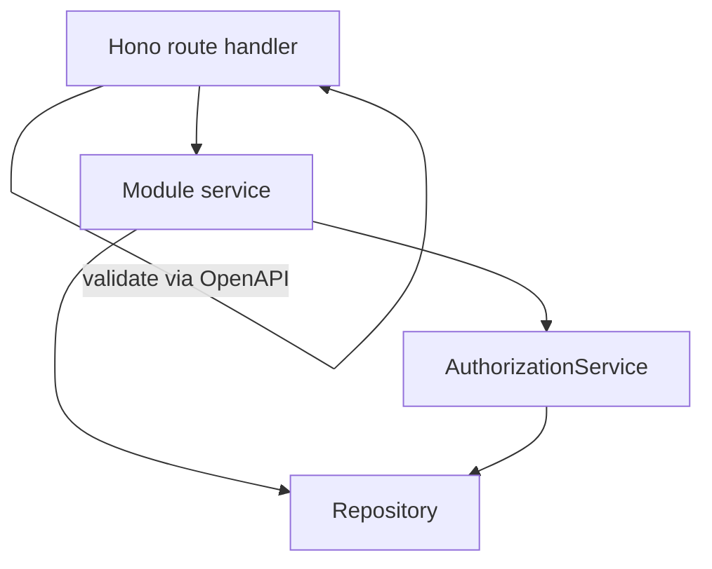
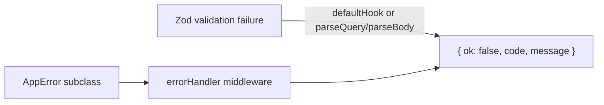

# API backbone completion — Design

- **Date:** 2026-06-15
- **Scope:** `workers/api` — finish the F1–F5 backbone hardening follow-up (route auth drift, service-layer gaps, validation message alignment)
- **Depends on:** [2026-06-06-backbone-hardening plan](../plans/2026-06-06-backbone-hardening-f2-remaining-f3-f4-f5.md) (F1–F5 core items are **done**)
- **Status:** approved — ready for implementation plan

## Problem

The June 2026 backbone hardening epic (F1–F5) landed the shared primitives: cursor pagination, `AuthorizationService`, `createApp()` validation envelope, query allowlists on all `findAll` repos, and `ServiceInstaller` decoupling. A follow-up review found remaining debt:

1. **Route-layer auth drift** — five modules duplicate `assertBusinessOwner` or inline `business.ownerId !== userId` instead of using `c.var.authz`.
2. **Misleading manager gates** — analytics, campaigns, customers, khata, and payments advertise `requireAuth(["owner", "manager"])` but enforce owner-only access via `assertBusinessOwner`; managers always get 403.
3. **Route-fat modules** — seven modules instantiate repositories directly in handlers, bypassing the Route → Service → Repository layering.
4. **Inline error returns** — bookings, staff-availability, and favourites return `c.json({ ok: false, … })` instead of throwing `AppError` subclasses.
5. **Validation message inconsistency** — `parseQuery`/`parseBody` surface only the first Zod issue; `createApp()` `defaultHook` joins all issues with `"; "`.

## Decisions

| Decision | Choice |
|----------|--------|
| Manager access on business-level routes | **Honest owner-only gate** — remove `manager` from `requireAuth` on routes that are owner-only today; no new manager permissions |
| Delivery | **Security-first phased** — three mergeable PRs (auth → services → thin modules + validation) |
| Behaviour contract | **Preserving** except correcting misleading manager gates (managers who previously got 403 still get 403, earlier at middleware) |
| Success envelopes | **Unchanged** |
| Schema / api-client | **Out of scope** |

## Architecture



**Error path (all phases):**



---

## Phase 1 — Auth honesty & drift removal

Small, security-focused PR. Routes may remain fat; goal is correct gates, centralised auth, thrown errors only.

### 1a. Honest owner-only gates

| Module | Current `requireAuth` | New |
|--------|----------------------|-----|
| `analytics/index.ts` | `["owner", "manager"]` | `["owner"]` |
| `campaigns/index.ts` | `["owner", "manager"]` | `["owner"]` |
| `customers/index.ts` | `["owner", "manager"]` | `["owner"]` |
| `khata/index.ts` | `["owner", "manager"]` | `["owner"]` |
| `payments/index.ts` | `["owner", "manager"]` | `["owner"]` |

Managers get **403 at the middleware layer**. Effective access is unchanged.

Routes keeping `["owner", "manager"]` with `{ branchScope: true }` are untouched: bookings, orders, products, services, staff-availability, walk-in.

### 1b. Delete duplicate ownership helpers

Remove identical local `assertBusinessOwner` functions in `analytics`, `campaigns`, and `customers` (each called `new BusinessesRepository(getDB())`).

Replace with:

```ts
await c.var.authz.assertBusinessOwner(c.var.user.id, businessId);
```

Delete `getDB` + `BusinessesRepository` imports from those three route files.

### 1c. Bookings inline auth → `authz` + throws

| Location | Replacement |
|----------|-------------|
| `exportRoute` owner check | `await c.var.authz.assertBusinessOwner(userId, businessId)` |
| `listByBranchRoute` missing params | `throw new ValidationError("branchId or businessId required")` |
| `listByBranchRoute` owner check | `await c.var.authz.assertBusinessOwner(...)` when `scopedIds === null` |
| `calendarRoute` manager scope | `throw new ForbiddenError("Not assigned to this branch")` |
| `calendarRoute` owner check | `await c.var.authz.assertBranchAccess(userId, branchId, null)` |

Business logic (CSV generation, multi-branch fan-out) stays in routes for Phase 1; moved to `BookingsService` in Phase 2.

### 1d. Staff-availability — new `authz` method

Add to `AuthorizationService`:

```ts
async assertTeamMemberAccess(
  actorId: string,
  memberId: string,
  scopedBranchIds: string[] | null,
): Promise<TeamMemberSelect>
```

- **`scopedBranchIds === null` (owner):** `assertBusinessOwner` on member's `businessId`
- **Manager/staff:** member's `branchId` must be in `scopedBranchIds`; else `ForbiddenError("Not authorized to access this staff member")`

Replaces route-local `assertMemberAccess` helper and inline JSON error returns.

### 1e. Phase 1 files

| Action | Path |
|--------|------|
| Modify | `workers/api/src/modules/analytics/index.ts` |
| Modify | `workers/api/src/modules/campaigns/index.ts` |
| Modify | `workers/api/src/modules/customers/index.ts` |
| Modify | `workers/api/src/modules/khata/index.ts` |
| Modify | `workers/api/src/modules/payments/index.ts` |
| Modify | `workers/api/src/modules/bookings/index.ts` |
| Modify | `workers/api/src/modules/staff-availability/index.ts` |
| Modify | `workers/api/src/core/authorization.ts` |
| Extend tests | `authorization.test.ts`, route tests for above modules |
| Update docs | `workers/api/CLAUDE.md`, `docs/guides/api-endpoints.md` |

### 1f. Phase 1 tests

- `assertTeamMemberAccess`: owner path, in-scope manager, out-of-scope manager
- Manager token → **403** on analytics (representative for all five owner-only modules)
- Bookings + staff-availability forbidden paths return unified envelope via `errorHandler`

---

## Phase 2 — Service extraction

Move business logic from route handlers into services. Routes: validate → `c.var.*Service` → shape response.

### 2a. New service classes

#### `AnalyticsService` (`analytics/analytics.service.ts`)

Every method: `authz.assertBusinessOwner(actorId, businessId)` → `AnalyticsRepository` call.

Methods: `overview`, `revenue`, `topServices`, `peakHours`, `reviewStats`, `couponStats`, `staffStats`, `earnings`.

Move `getRange(days)` from `index.ts` into the service as a private helper.

#### `CustomersService` (`customers/customers.service.ts`)

| Method | Logic |
|--------|-------|
| `list(actorId, businessId)` | `assertBusinessOwner` → `listByBusiness` |
| `visits(actorId, businessId, userId)` | `assertBusinessOwner` → `getCustomerVisits` |

#### `CampaignsService` (`campaigns/campaigns.service.ts`)

| Method | Logic |
|--------|-------|
| `list` | `assertBusinessOwner` → `findByBusiness` |
| `create` | `assertBusinessOwner` → `create` (channels JSON serialisation in service) |
| `update` | load → `assertBusinessOwner` → `updateOne` |
| `send` | ownership + `businessId` match → segment recipient count via `CustomersRepository` → mark Sent |
| `delete` | load → `assertBusinessOwner` → `deleteOne` |

Constructor: `CampaignsRepository`, `CustomersRepository`, `AuthorizationService`.

#### `StaffAvailabilityService` (`staff-availability/staff-availability.service.ts`)

| Method | Logic |
|--------|-------|
| `get(actorId, memberId, scopedBranchIds)` | `assertTeamMemberAccess` → `findByMember` |
| `upsert(actorId, memberId, slots, scopedBranchIds)` | `assertTeamMemberAccess` → loop `upsertDay` → `findByMember` |

### 2b. `BookingsService` extensions

| Method | Logic |
|--------|-------|
| `listByBusiness(actorId, businessId, scopedBranchIds, opts?)` | Owner: `assertBusinessOwner`. Manager: trust `scopedBranchIds`. Fetch branches, filter, fan-out `findByBranch`, optional status filter + limit. Returns `{ data, query }` envelope. |
| `exportCsv(actorId, businessId, status, scopedBranchIds)` | Same auth + branch fan-out. Build CSV (RFC 4180 `csvField` helper moves here). Returns `{ csv, filename }`. |
| `calendar(actorId, branchId, start, end, scopedBranchIds)` | `assertBranchAccess` → `findByBranchInRange` |

No new constructor deps — `branchesRepo` and `authz` already injected.

### 2c. Wiring

Each module exports `install*Service: ServiceInstaller` from `index.ts`, registered in `routes.ts`:

```ts
installAnalyticsService,
installCustomersService,
installCampaignsService,
installStaffAvailabilityService,
```

Add to `types/index.ts` Variables:

- `analyticsService: AnalyticsService`
- `customersService: CustomersService`
- `campaignsService: CampaignsService`
- `staffAvailabilityService: StaffAvailabilityService`

Construct repos inside installers from `deps.db` (follow `installRewardsService` pattern) unless shared via `SharedDeps`.

### 2d. Phase 2 tests

| Module | Service unit test | Route integration test |
|--------|-------------------|------------------------|
| analytics | authz delegation + repo call | update `analytics.routes.test.ts` to mock service |
| customers | new `customers.service.test.ts` | new `customers.routes.test.ts` |
| campaigns | authz + send recipient logic | update `campaigns.routes.test.ts` |
| staff-availability | `assertTeamMemberAccess` paths | extend route tests |
| bookings | export + listByBusiness + calendar | extend `bookings.routes.test.ts` |

---

## Phase 3 — Thin services & validation polish

### 3a. Thin service extraction

#### `FavouritesService` (`favourites/favourites.service.ts`)

Self-scoped. No `authz`.

| Method | Logic |
|--------|-------|
| `list(userId)` | `findByUser` |
| `check(userId, businessId)` | `findOne` → `{ isFavourited }` |
| `add(userId, businessId)` | duplicate → `throw ConflictError("Already favourited")` |
| `remove(userId, businessId)` | missing → `throw NotFoundError("Not in favourites")` → `remove` |

#### `DemoRequestsService` (`demo-requests/demo-requests.service.ts`)

| Method | Logic |
|--------|-------|
| `create(body)` | `repo.create(body)` |

Rate limiting stays on the route.

#### `SearchService` (`search/search.service.ts`)

| Method | Logic |
|--------|-------|
| `search(vertical, params, ai?)` | delegate to `bookingSearch` or `commerceSearch` |

### 3b. Wiring (Phase 3)

```ts
installFavouritesService,
installDemoRequestsService,
installSearchService,
```

Add to `types/index.ts`: `favouritesService`, `demoRequestsService`, `searchService`.

### 3c. Validation message unification

Extract shared helper in `src/core/http/validation.ts`:

```ts
export function formatZodIssues(issues: ZodIssue[]): string {
  return issues.map((i) => i.message).join("; ") || "Validation failed";
}
```

Use in `create-app.ts` `defaultHook`, `parseQuery`, and `parseBody`.

### 3d. Error handling contract (epic-wide)

| Source | Mechanism | Response |
|--------|-----------|----------|
| Zod-OpenAPI route validation | `defaultHook` | `{ ok: false, code: "VALIDATION_ERROR", message }` 422 |
| `parseQuery` / `parseBody` | `throw ValidationError` → `errorHandler` | same |
| Business / auth rules | `throw AppError` → `errorHandler` | `{ ok: false, code, message }` + status |
| **Banned in route handlers** | `return c.json({ ok: false, … })` | — |

**Unchanged:** `auth/index.ts` session-not-found inline return (not a Zod path).

### 3e. Phase 3 tests

- Favourites service + route tests (conflict/not-found throws)
- Search route smoke test
- Validation helper test: multi-issue schema → joined `"; "` message

---

## Documentation

| Doc | Changes |
|-----|---------|
| `workers/api/CLAUDE.md` | Owner-only route list; service inventory; banned inline-error rule |
| `docs/guides/api-query-repository-pattern.md` | Route authorization table; new services |
| `docs/guides/api-endpoints.md` | Role gate corrections |
| `docs/superpowers/plans/2026-06-06-backbone-hardening-f2-remaining-f3-f4-f5.md` | Mark F2–F5 DONE; link here for follow-up |

## Verification (each phase)

```sh
bun run --filter @repo/api test
bun run lint
bun run build   # final phase only, or equivalent scoped build
```

Green baseline (~300 tests) must hold throughout. Any test behaviour change is a signal to re-confirm the contract before updating assertions.

## Out of scope

- New manager permissions on business-level routes
- Success-response envelope changes
- Schema / migration changes
- `@repo/api-client` changes
- `auth/index.ts` session-not-found inline return refactor
