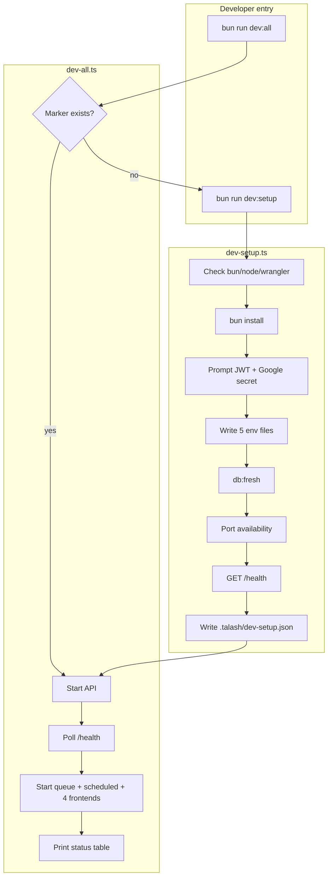

# Local dev workflow — Design

- **Date:** 2026-06-15
- **Scope:** Monorepo root — onboarding wizard + full-stack dev orchestrator
- **Status:** approved — ready for implementation plan

## Problem

Talash's local stack spans six long-running processes (API, queue, scheduled, two Next.js sites, two Expo apps) and five env file locations. Onboarding is manual: copy scattered `.env.example` files, hunt for secrets, uncomment localhost URLs, seed the DB, and start each service in separate terminals. `.env.example` files default to production API URLs, so a missed step silently points frontends at staging/production.

There is no single "am I ready?" check and no unified daily start command. CI runs `bun run build` but does not help a new developer reach a working full stack with auth.

## Goal

**One-time setup wizard + one daily command** that brings up the full local stack with end-to-end Google OAuth working on all four frontends.

| Requirement | Detail |
| --- | --- |
| Onboarding | Interactive first-run wizard with prerequisite checks, secret prompts, env generation, DB seed, port check, API health probe |
| Daily workflow | `bun run dev:all` starts every service in the correct order with grouped logs and a status summary |
| Auth parity | Web OAuth + Expo Go redirect flow working locally; hybrid secret model (team vault for secrets, shared public client ID) |
| Idempotent setup | Re-runnable; skips satisfied steps; `--force` regenerates env files |

## Decisions

| Area | Decision |
| --- | --- |
| **Approach** | Root orchestrator scripts (`scripts/dev-setup.ts`, `scripts/dev-all.ts`) — not Turbo-only, not CLI subcommand (may migrate later) |
| **Entry commands** | `bun run dev:setup` (wizard), `bun run dev:all` (orchestrator; auto-runs setup if marker missing) |
| **Setup marker** | `.talash/dev-setup.json` (gitignored) records version, ports, completion timestamp |
| **Secrets model** | Hybrid: `JWT_SECRET` + `GOOGLE_CLIENT_SECRET` from team vault (interactive prompt or `TALASH_DEV_SECRETS` JSON env); public `GOOGLE_CLIENT_ID` hardcoded from docs |
| **Mobile OAuth** | `EXPO_PUBLIC_AUTH_PROVIDER=redirect` (Expo Go); no native `@react-native-google-signin` for local dev |
| **DB seed** | `bun run db:fresh` on first setup (100 users via root alias) |
| **Health gate** | Frontends start only after `GET http://localhost:8787/health` returns 200 (30 s timeout) |
| **Out of scope** | Staging API switching, Docker/Dev Containers, native mobile OAuth locally, EAS cloud builds |

## Architecture



### Process startup order

| Order | Service | Root command | Port |
| --- | --- | --- | --- |
| 1 | API | `bun run api:dev` | 8787 |
| 2 | Queue | `bun run queue:dev` | — |
| 3 | Scheduled | `bun run scheduled:dev` | — |
| 4 | Marketing site | `bun run marketing-site:dev` | 3000 |
| 5 | Business dashboard | `bun run business-dashboard:dev` | 3001 |
| 6 | Mobile app | `bun run mobile-app:dev` | Expo |
| 7 | Owner app | `bun run owner-app:dev` | Expo |

API, queue, and scheduled start first. Frontends wait for API health. Ctrl+C / SIGTERM kills the entire process group.

## Wizard UX

### Entry points

- `bun run dev:setup` — always runs the wizard (idempotent)
- `bun run dev:all` — runs setup first if `.talash/dev-setup.json` is missing or `version` is stale

### Steps (7)

```
Talash dev setup
────────────────
[1/7] Prerequisites     bun 1.3.1 ✓  node 20+ ✓  wrangler ✓
[2/7] Dependencies        bun install ✓
[3/7] Secrets           JWT_SECRET ✓  GOOGLE_CLIENT_SECRET ✓
[4/7] Env files         5 files written ✓
[5/7] Database          seeded ✓
[6/7] Ports             8787 3000 3001 free ✓
[7/7] Health check      GET /health → 200 ✓

Setup complete. Run: bun run dev:all
```

### Secrets input (step 3)

Resolution order:

1. `TALASH_DEV_SECRETS` env var — JSON `{ "jwtSecret": "…", "googleClientSecret": "…" }` (automation/CI)
2. Interactive masked prompts
3. Print team-vault instructions + link to `docs/guides/google-auth.md`; exit non-zero

Public values are **not** prompted:

- `GOOGLE_CLIENT_ID` = `163196138441-dvuciv0t2ddnkr61fck5r9i9v2jq0a64.apps.googleusercontent.com`
- Same value for `NEXT_PUBLIC_GOOGLE_CLIENT_ID` on both Next.js sites

### Idempotency

- If env files exist and localhost values are correct → skip write
- `bun run dev:setup --force` → regenerate all env files regardless
- If a key var points at production (e.g. `NEXT_PUBLIC_API_URL=https://api.talash.bd`) → warn and offer to fix

### Setup marker (`.talash/dev-setup.json`)

```json
{
  "version": 1,
  "completedAt": "2026-06-15T12:00:00.000Z",
  "ports": { "api": 8787, "marketing": 3000, "dashboard": 3001 },
  "secretsSource": "interactive"
}
```

Add `.talash/` to root `.gitignore`.

## Generated env files

Templates live in `scripts/dev/templates/` — **not** copied from gitignored `.env.example` files (which may contain stale or production values).

### `workers/api/.dev.vars`

| Variable | Value |
| --- | --- |
| `ENVIRONMENT` | `development` |
| `JWT_SECRET` | from vault |
| `GOOGLE_CLIENT_ID` | shared public client ID |
| `GOOGLE_CLIENT_SECRET` | from vault |
| `ALLOWED_ORIGINS` | `http://localhost:3000,http://localhost:3001` |
| `ALLOWED_RESET_URIS` | `http://localhost:3000/auth/reset-password,http://localhost:3001/auth/reset-password,mobileapp://auth/reset-password,ownerapp://auth/reset-password` |
| `PUBLIC_R2_URL` | `https://storage.talash.bd` |
| `EMAIL_FROM` | `noreply@talash.bd` |

### `sites/marketing-site/.env.local`

```
NEXTJS_ENV=development
API_URL=http://localhost:8787
NEXT_PUBLIC_API_URL=http://localhost:8787
NEXT_PUBLIC_SITE_URL=http://localhost:3000
NEXT_PUBLIC_GOOGLE_CLIENT_ID=163196138441-dvuciv0t2ddnkr61fck5r9i9v2jq0a64.apps.googleusercontent.com
```

### `sites/business-dashboard/.env.local`

```
NEXTJS_ENV=development
API_URL=http://localhost:8787
NEXT_PUBLIC_API_URL=http://localhost:8787
NEXT_PUBLIC_SITE_URL=http://localhost:3001
NEXT_PUBLIC_MARKETING_URL=http://localhost:3000
NEXT_PUBLIC_GOOGLE_CLIENT_ID=163196138441-dvuciv0t2ddnkr61fck5r9i9v2jq0a64.apps.googleusercontent.com
```

### `apps/mobile-app/.env` and `apps/owner-app/.env`

```
EXPO_PUBLIC_API_URL=http://localhost:8787
EXPO_PUBLIC_AUTH_PROVIDER=redirect
```

Queue and scheduled workers need no local secrets — started as-is.

## Orchestrator behaviour

`scripts/dev-all.ts`:

- Spawn 7 child processes via `Bun.spawn` with prefixed log lines (`[api]`, `[marketing]`, …)
- Poll `http://localhost:8787/health` (500 ms interval, 30 s timeout) before starting frontends
- On ready, print status table:

```
Service              URL                          Status
─────────────────────────────────────────────────────────
API                  http://localhost:8787         ✓
Marketing site       http://localhost:3000         ✓
Business dashboard   http://localhost:3001         ✓
Mobile app           Expo DevTools                 ✓
Owner app            Expo DevTools                 ✓
Queue worker         (background)                  ✓
Scheduled worker     (background)                  ✓
```

- Ctrl+C → kill all children

## Error handling

| Failure | Behaviour |
| --- | --- |
| Port in use | Name port; suggest `lsof -i :PORT` |
| API health timeout | Show last 20 lines of API stderr; exit 1 |
| Missing secrets | Vault instructions + link to `docs/guides/google-auth.md`; exit 1 |
| Child crash | Log which service died; tear down siblings |
| Stale marker version | Re-run setup automatically |

## Files to add / change

| Path | Action |
| --- | --- |
| `scripts/dev-setup.ts` | New — wizard |
| `scripts/dev-all.ts` | New — orchestrator |
| `scripts/dev/templates/*.env` | New — env templates |
| `scripts/dev/constants.ts` | New — ports, client ID, allowed origins |
| `scripts/__tests__/dev-setup.test.ts` | New — template rendering, port helpers |
| `package.json` | Add `dev:setup`, `dev:all` scripts |
| `.gitignore` | Add `.talash/` |
| `docs/getting-started.md` | Lead with `dev:setup` / `dev:all` |
| `docs/guides/local-dev.md` | New — full reference |
| `docs/README.md` | Link local-dev guide |
| `AGENTS.md` | Add dev workflow commands |

## Testing

| Layer | Coverage |
| --- | --- |
| Unit | Template rendering produces expected localhost URLs; port-check helper; marker read/write |
| Manual smoke | Fresh clone → `dev:setup` → `dev:all` → Google sign-in on marketing, dashboard, both Expo apps |

## Related docs

- [getting-started.md](../../getting-started.md)
- [guides/environment-variables.md](../../guides/environment-variables.md)
- [guides/google-auth.md](../../guides/google-auth.md)
- [guides/eas-deployment.md](../../guides/eas-deployment.md) — EAS builds remain manual; CI `build` uses `expo export --platform android`
